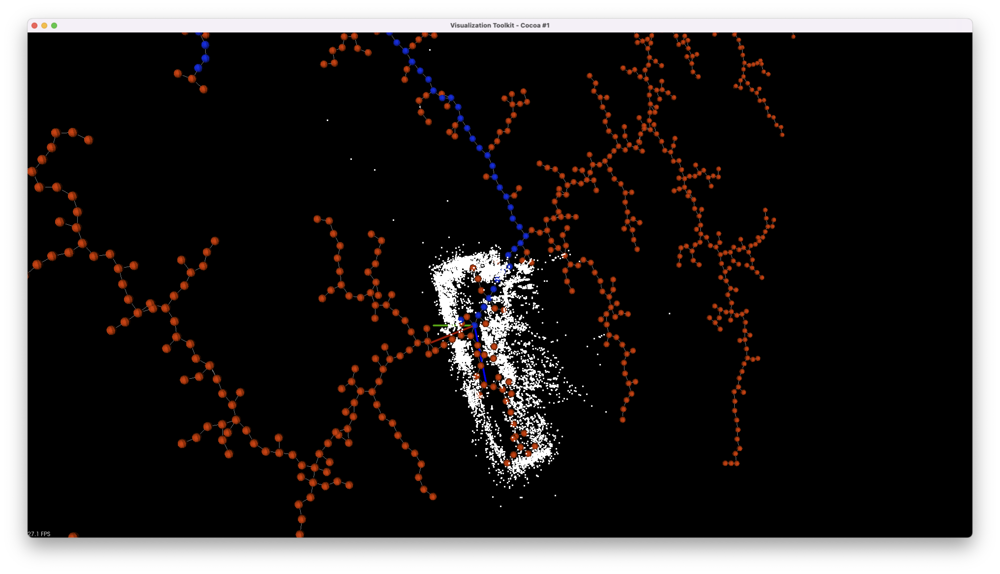
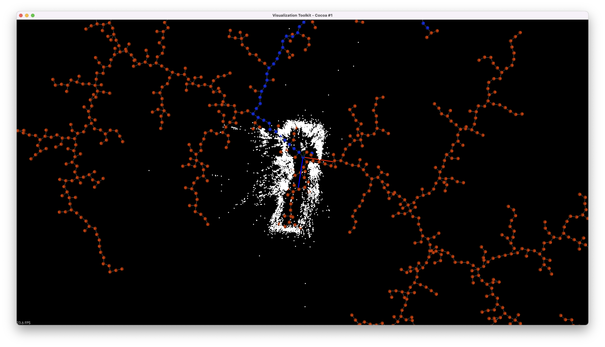

# Path Searching In PointCloud 

## Summary 

* [Description](#description)
* [Requirement](#requirement)
* [Building The Project](#building-the-project)
* [Simple Example](#simple-example)
* [Custom Installation](#custom-installation)
* [Running The Demo](#running-the-demo)
*****


## Description 

In this project the goal is to find a path to the unknown or explored 
territory of a PointCloud model/map




*****
## Requirement
In order for this project to build one should install the following 
packages

* The [Clang](https://clang.llvm.org) C++ compiler,
* The [cmake](https://cmake.org) tools family,
 
Then one should install this repo

* The [lemon](https://lemon.cs.elte.hu/trac/lemon) Graph Algorithms
* The [PCL](https://pointclouds.org/downloads/) The Point Cloud library

*****
## Building The Project

For building the project one should build the 
project like any `cmake` project

``` 
cd /into/the/git/repo 
mkdir build
cmake ../
cmake --build . -j{number of cores -1 }
```

## Running The Demo 
For Running the demo build as instructed above , and use the following commands

```
cd build
cd tests
./generalized_test
```
To continue to next simulation click `q`
if you want to change to a bigger scalefactor do

``` 
./generalized_test 0.7
```
It'll set ScaleFactor to 0.7

*****
For running on special pcd file use the following commands

```
cd build
cd tests
./simple_visualize_test [Path_To_pcd_file]
./simple_visualize_test ../a20m12.pcd
```

and also will work this 

```
cd build
cd tests
./simple_visualize_test [Path_To_pcd_file] [ScaleFactor]
./simple_visualize_test ../a20m12.pcd 0.6
```


*****

## Simple Example

The Project frontend implement a build design pattern 
For finding a simple Path one should first link via cmake 
against the target `ExportedTargetPathPlanning` like so

``` 4d
add_executable(my_executable main.cpp)
target_link_library(my_executable PUBLIC ExportedTargetPathPlanning)
```
and in your `main.cpp` or whatever file you are using 
simply do 

``` 4d
#include "exported_target_path_planning.h"
```

In order to use the important function one should instantiate 
the object `PathBuilder`

``` 4d
PathBuilder pb();
```
or if you know what you are doing set the parameters like so 

``` 4d
pb.setHowLongIsValidPath(10).setHowManyTimesTriesEachScaleFactor(5)
```

for the path itself one should give PointCloud , 3 point which forms a 
plane on which the RRT will generate Paths , Starting Point .

It should look something like this

``` 4d
int main(){
  pcl::PointCloud<pcl::PointXYZ>::Ptr cloud(new pcl::PointCloud<pcl::PointXYZ>);
  // Open some pointcloud
  pcl::PointXYZ knownPoint1 = {-0.0121305, -0.0730789, 0.517468};
  pcl::PointXYZ knownPoint2 = {-0.0177447, -0.0546628, 0.334396};
  pcl::PointXYZ knownPoint3 = {-0.134929, -0.0606948, 0.345245};
  pcl::PointXYZ StartPoint = {-0.134929, -0.0606948, 0.345245};
  PathBuilder pb();
  std::list path_outside_known_list = pb(cloud,StartingPoint,knownPoint1,knownPoint2,knownPoint3)
  //Go To Those Point on the List for further exploration !!!
}
```
Yay we are done !!!!


*****

## Custom Installation 

Custom installation should look something like this
```
cmake -DLEMON_DIR=/Users/barakdiker/custom_install_app/usr/local/share/lemon/cmake ../
cmake -DQt5_DIR=/opt/homebrew/opt/qt@5/lib/cmake/Qt5 ../
```
